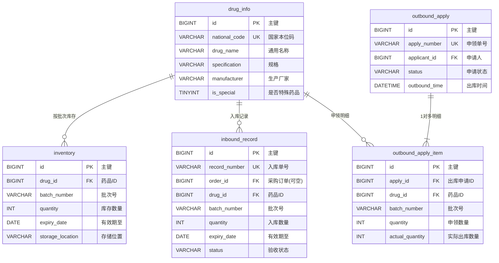
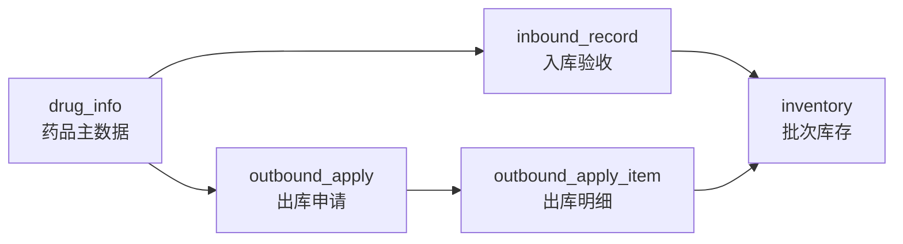

# CDIOM 核心业务简易 E-R 图

仅展示**药品信息、库存、入库、出库**相关关键表及主要外键关系，便于答辩、汇报或快速理解数据模型。完整设计见 [Database_Design.md](./Database_Design.md)。

---

## 实体关系图（Mermaid）

在支持 Mermaid 的编辑器（如 VS Code、Typora、GitHub）中可直接渲染下图。

---

## 关系说明（文字版）

| 关系 | 类型 | 说明 |
|------|------|------|
| 药品信息 → 库存 | 1 : N | 一种药品可有多个批次库存；`(drug_id, batch_number)` 唯一 |
| 药品信息 → 入库记录 | 1 : N | 每次验收产生一条入库记录，可关联采购订单或临时入库 |
| 出库申请 → 出库明细 | 1 : N | 一张申领单包含多种药品 |
| 药品信息 → 出库明细 | 1 : N | 明细行指定药品及批次、数量 |
| 入库 → 库存 | 业务更新 | 合格入库后按 `drug_id + batch_number` 增加或新建库存行（无直接外键） |
| 出库 → 库存 | 业务更新 | 审批执行后按 FIFO 扣减对应批次 `quantity`（无直接外键） |

---

## 业务流程（简图）

---

## 各表职责（一句话）

- **drug_info**：药品主数据（名称、规格、厂家、是否特殊药品等）。
- **inventory**：当前在库数量，按「药品 + 批次」管理，支撑近效期预警与 FIFO 出库。
- **inbound_record**：每次到货验收的流水；入库成功后写入/累加库存。
- **outbound_apply**：医护人员申领单头（状态：待审 → 已批 → 已出库 / 驳回）。
- **outbound_apply_item**：申领的具体药品、批次与数量；执行出库时扣减库存。

---

## 可选扩展（未画入上图）

若需体现采购链路，可增加：

- `purchase_order` ← `inbound_record.order_id`（订单入库）
- `purchase_order_item` ← 订单明细

系统表（`sys_user` 等）在入库操作人、出库申请人/审批人字段上关联，简易图中省略。

---

**文档创建时间**：2026年5月20日
